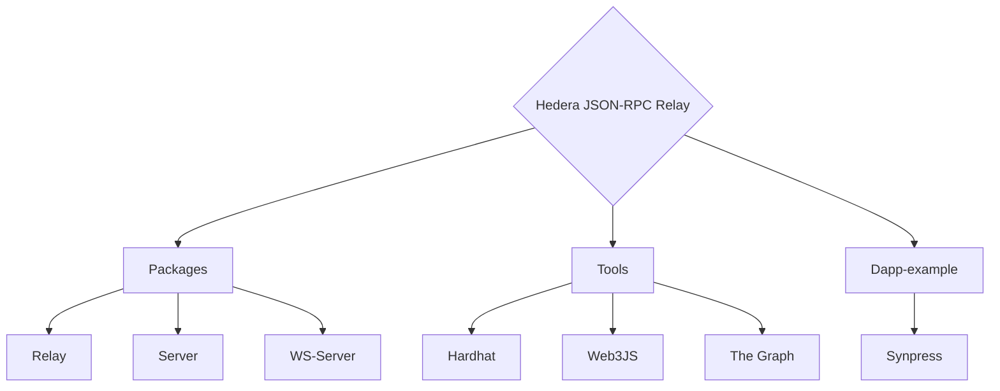

```mermaid
flowchart TD
A{Hedera JSON-RPC Relay}
A --> B[Packages]
A --> C[Tools]
A --> D[Dapp-example]
B --> E[Relay]
B --> F[Server]
B --> G[WS-Server]
C --> H[Hardhat]
C --> I[Web3JS]
C --> J[The Graph]
D --> K[Synpress]
```
